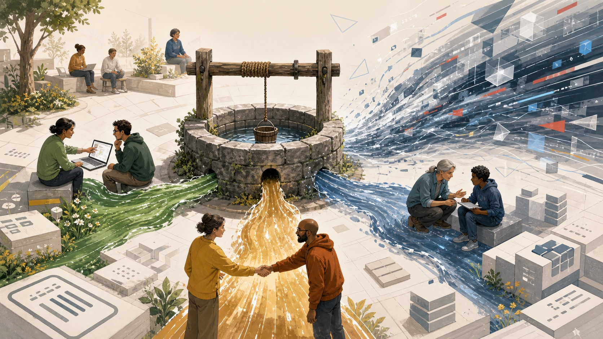
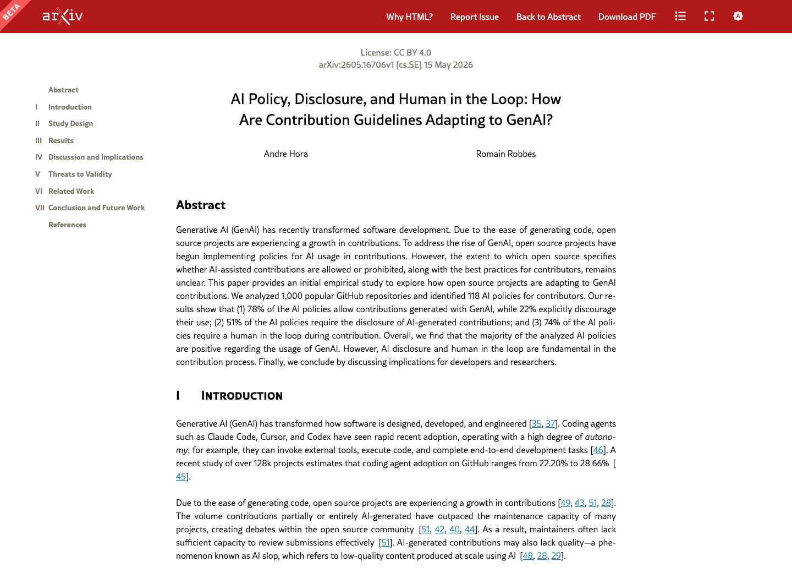
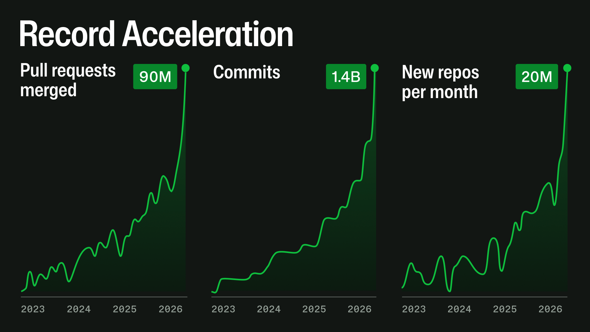
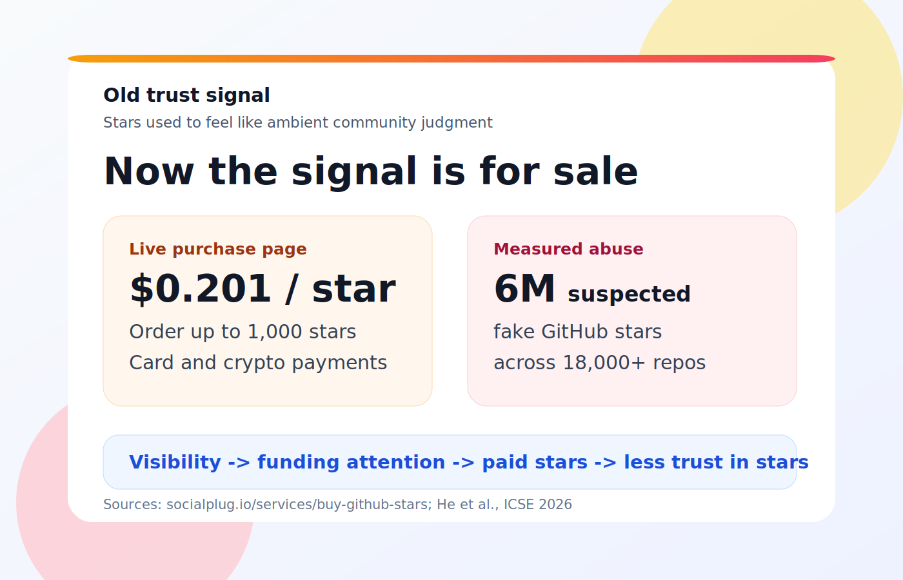
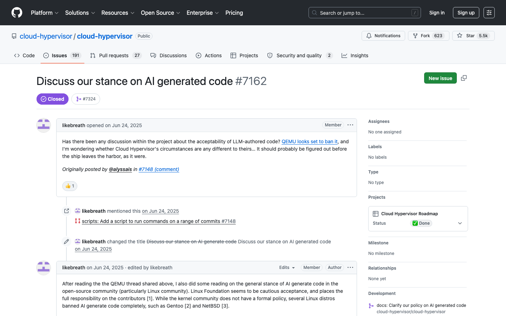
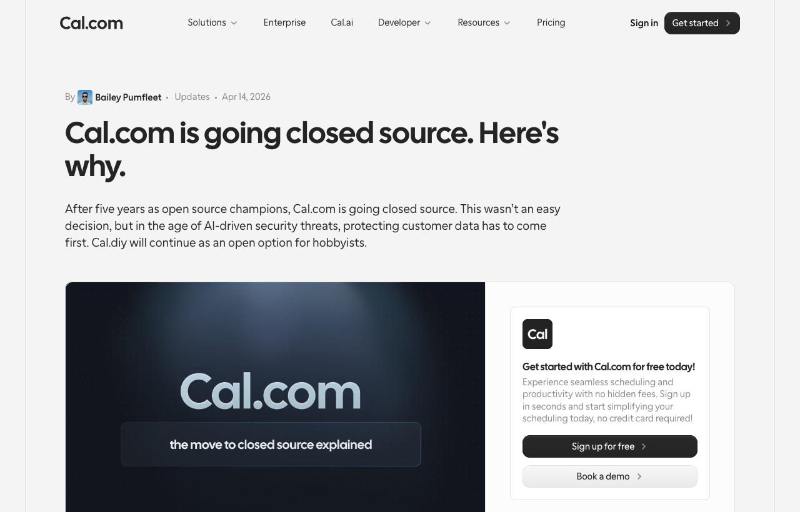

---
format:
  revealjs:
    css: style.css
    theme: simple
    slide-number: true
    code-line-numbers: false
    preview-links: auto
    keyboard: true
    touch: true
    help: true
    include-in-header: meta-tags.html
    link-external-newwindow: true
revealjs-plugins:
  - fontawesome
execute:
  echo: true
  eval: false
keywords: ["open-source", "foss", "ai", "software-security", "maintainers"]
description-meta: "A presentation about how AI-generated pull requests, new security attack surfaces, and collapsing trust are poisoning the FOSS movement."
license: "CC0 1.0 Universal"
pagetitle: "Poisoning the FOSS Well"
author-meta: "Indrajeet Patil"
date-meta: "2026-04-18"
lang: "en"
dir: "ltr"
image: "media/social-media-card.png"
image-alt: "Preview image for presentation about AI poisoning the FOSS movement"
canonical-url: "https://www.indrapatil.com/ai-poisoned-foss-well/"
jupyter: python3
---

## Poisoning the FOSS Well {style="margin-top: 1.5em; margin-bottom: 1em;"}

:::: {.columns}

::: {.column width="56%"}

::: {style="margin-top: 1.5em; margin-bottom: 1em;"}

::: {style="font-size: 0.92em; font-weight: bold;"}
How AI is Poisoning the Free and Open Source Software Movement
:::

::: {style="font-size: 0.8em; margin-top: 1em;"}
Indrajeet Patil

::: {style="font-size: 0.85em; margin-top: 0.3em;"}
**[FOSS developer](https://www.indrapatil.com/experience/open-source/), 8+ years**
:::
:::

:::

:::

::: {.column width="44%"}

{.hero width="310" height="430" fig-alt="An old water well in a grassy field"}

:::

::::

::: {style="text-align: center; font-size: 0.55em; margin-top: 1.4em; color: #666;"}
Photo: [Daniel Prado / Unsplash](https://unsplash.com/photos/old-wishing-well-in-a-grassy-field-with-trees-U08P3HTx3SI)
:::

::: {style="text-align: center; font-size: 0.6em; margin-top: 0.9em; color: #666;"}
Source code for these slides can be found [on `GitHub`](https://github.com/IndrajeetPatil/ai-poisoned-foss-well/).
:::

## FOSS is a giant hidden subsidy {.smaller}

:::: {.columns}

::: {.column width="62%"}

{.illustration width="640" height="360" fig-alt="Generated scientific cross-section illustration showing visible software products supported by a much larger hidden open-source dependency network"}

:::

::: {.column width="38%"}

::: {style="background-color: #e3f2fd; padding: 13px; border-radius: 18px; margin-bottom: 9px; font-size: 0.7em;"}
**96%** of codebases include open-source software.

::: {style="font-size: 0.75em; margin-top: 12px; color: #444;"}
Synopsys OSSRA report, cited by Harvard
:::

:::

::: {style="background-color: #e8f5e9; padding: 13px; border-radius: 18px; margin-bottom: 9px; font-size: 0.7em;"}
**$8.8T** estimated global replacement value.

::: {style="font-size: 0.75em; margin-top: 12px; color: #444;"}
Harvard demand-side estimate
:::

:::

::: {style="background-color: #fff3e0; padding: 13px; border-radius: 18px; font-size: 0.68em;"}
**2-5x** reported ROI for organisations that contribute upstream.

::: {style="font-size: 0.75em; margin-top: 12px; color: #444;"}
Linux Foundation, 2026
:::

:::

:::

::::

::: {style="background-color: #FFFBC1; padding: 18px; border-radius: 25px; text-align: center;"}
Modern software runs on FOSS. Pollute the commons, pay a systemic cost.
:::

::: {style="text-align: center; font-size: 0.55em; margin-top: 0.9em; color: #666;"}
Sources: [HBS AI Institute, 2024](https://d3.harvard.edu/revealing-value-the-economic-power-of-open-source-software/) · [Linux Foundation, 2026](https://www.linuxfoundation.org/press/new-linux-foundation-report-shows-active-open-source-contribution-delivers-2-5x-roi-while-passive-consumption-increases-costly-technical-debt)
:::

## The well is a social system {.smaller}

:::: {.columns}

::: {.column width="62%"}

{.illustration width="630" height="355" fig-alt="Generated illustration of an open-source commons as a stone well fed by review labour, trust, and reciprocity, with a synthetic digital current disturbing the system"}

:::

::: {.column width="38%"}

::: {style="background-color: #e3f2fd; padding: 14px; border-radius: 18px; margin-bottom: 10px; font-size: 0.72em;"}
**Review labour** turns raw patches into shared infrastructure.
:::

::: {style="background-color: #e8f5e9; padding: 14px; border-radius: 18px; margin-bottom: 10px; font-size: 0.72em;"}
**Trust** lets contributors begin with a presumption of good faith.
:::

::: {style="background-color: #ffebee; padding: 14px; border-radius: 18px; font-size: 0.72em;"}
**Reciprocity** is the implicit exchange that sustains the ecosystem.
:::

:::

::::

::: {style="background-color: #FFFBC1; padding: 18px; border-radius: 25px; text-align: center;"}
LLMs change the cost model of all three at once.
:::

::: {style="background-color: #f8f9fa; border-left: 4px solid #007bff; padding: 10px 12px; font-size: 0.58em; margin-top: 0.65em; color: #444;"}
**Boundary:** Low-quality PRs and burnout predate LLMs. AI changes speed, volume, and plausibility; the underlying commons problem is still under-compensated maintainer labour.
:::

## Community {style="margin-top: 2.3em; text-align: left;"}

::: {style="text-align: left; font-size: 0.9em; color: #666; margin-top: 1.1em;"}
Review queues, contribution gates, and the pipeline.
:::

## Pollution of Pull Requests {.smaller}

:::: {.columns}

::: {.column width="39%"}

::: {style="background-color: #ffebee; padding: 16px; border-radius: 18px; margin-bottom: 16px;"}

::: {style="font-size: 1.15em; font-weight: bold; margin-bottom: 8px;"}
Cheap to submit.<br>
Expensive to review.
:::

- Plausible diff
- No context
- No ownership after feedback

:::

::: {style="background-color: #e3f2fd; padding: 16px; border-radius: 18px; font-size: 0.78em;"}
**Public example, February 2026**<br>
`Matplotlib` maintainer **Scott Shambaugh** rejected an AI-authored change. Hours later, an AI persona published a personal attack piece about him.
:::

:::

::: {.column width="61%"}

{.artifact width="620" height="500" fig-alt="Screenshot of Scott Shambaugh's post about an AI agent publishing a hit piece after a rejected pull request"}

:::

::::

::: {style="text-align: center; font-size: 0.55em; margin-top: 0.8em; color: #666;"}
Source: [Scott Shambaugh, "An AI Agent Published a Hit Piece on Me"](https://theshamblog.com/an-ai-agent-published-a-hit-piece-on-me/)
:::

## From default trust to explicit trust {.smaller}

::: {style="text-align: center; font-size: 0.78em; margin-bottom: 0.8em;"}
Mitchell Hashimoto is piloting a different model.
:::

:::: {.columns}

::: {.column width="50%"}

{.artifact width="500" height="360" fig-alt="Screenshot of Ghostty's contributing guide with its vouch system"}

::: {style="background-color: #e3f2fd; padding: 12px; border-radius: 14px; font-size: 0.72em; margin-top: 10px;"}
**`Ghostty`:** first-time contributors need a maintainer vouch before a PR can stay open.
:::

:::

::: {.column width="50%"}

{.artifact width="500" height="360" fig-alt="Screenshot of Mitchell Hashimoto's Vouch repository"}

::: {style="background-color: #e8f5e9; padding: 12px; border-radius: 14px; font-size: 0.72em; margin-top: 10px;"}
**`Vouch`:** trust becomes explicit before code arrives.
:::

:::

::::

::: {style="text-align: center; font-size: 0.55em; margin-top: 0.8em; color: #666;"}
Sources: [`Ghostty` CONTRIBUTING.md](https://github.com/ghostty-org/ghostty/blob/main/CONTRIBUTING.md) · [`Vouch`](https://github.com/mitchellh/vouch)
:::

## Narrower funnels {.smaller}

:::: {.columns}

::: {.column width="60%"}

{.artifact width="700" height="450" fig-alt="Stylized snapshot of tldraw's January 2026 issue announcing automatic closure of pull requests from external contributors"}

:::

::: {.column width="40%"}

::: {style="background-color: #ffebee; padding: 16px; border-radius: 18px; margin-bottom: 14px; font-size: 0.8em;"}
**`tldraw`, January 2026**<br>
An influential project announced it would automatically close pull requests from external contributors.
:::

::: {style="background-color: #e3f2fd; padding: 16px; border-radius: 18px; margin-bottom: 14px; font-size: 0.76em;"}
The repo stayed open for issues, bug reports, and discussions. The part that narrowed first was the expensive part: reviewable code contribution.
:::

::: {style="background-color: #fff3e0; padding: 16px; border-radius: 18px; font-size: 0.74em;"}
This is what "the commons hardening" looks like in practice: not total closure, but higher gates at exactly the points where AI volume is most costly.
:::

:::

::::

::: {style="text-align: center; font-size: 0.5em; margin-top: 0.7em; color: #666;"}
Source: [`tldraw` issue #7695, "Contributions policy"](https://github.com/tldraw/tldraw/issues/7695)
:::

## AI policy hardening is now measurable {.smaller}

:::: {.columns}

::: {.column width="42%"}

::: {style="background-color: #e3f2fd; padding: 14px; border-radius: 18px; margin-bottom: 10px; font-size: 0.68em;"}
**118 policies**<br>
found across 1,000 popular `GitHub` repositories in a May 2026 empirical scan.
:::

::: {style="background-color: #e8f5e9; padding: 14px; border-radius: 18px; margin-bottom: 10px; font-size: 0.68em;"}
**78% allow GenAI**<br>
but the permission usually comes with conditions, not blind acceptance.
:::

::: {style="background-color: #fff3e0; padding: 14px; border-radius: 18px; margin-bottom: 10px; font-size: 0.68em;"}
**51% require disclosure**<br>
and **74% require a human in the loop** during contribution.
:::

::: {style="background-color: #ffebee; padding: 14px; border-radius: 18px; font-size: 0.66em;"}
The emerging norm is not "no AI." It is: disclose it, own it, and prove a human did the review work.
:::

:::

::: {.column width="58%"}

{.artifact width="610" height="450" fig-alt="Screenshot of the May 2026 arXiv paper AI Policy, Disclosure, and Human in the Loop"}

:::

::::

::: {style="text-align: center; font-size: 0.48em; margin-top: 0.65em; color: #666;"}
Sources: [Hora & Robbes (arXiv, 2026)](https://arxiv.org/abs/2605.16706) · [open-source-ai-contribution-policies](https://github.com/melissawm/open-source-ai-contribution-policies)
:::

## `GitHub` wasn't built for this {.smaller}

:::: {.columns}

::: {.column width="52%"}

```{=html}


<div aria-label="GitHub April 2026 incident statistics" style="display: grid; grid-template-columns: 1fr 1fr; gap: 9px; margin-top: 11px;">
  <div style="background-color: #fff3e0; padding: 9px 11px; border-radius: 14px; font-size: 0.55em; line-height: 1.18;">
    <strong style="font-size: 1.55em;">10</strong><br>
    April incidents
  </div>
  <div style="background-color: #e8f5e9; padding: 9px 11px; border-radius: 14px; font-size: 0.55em; line-height: 1.18;">
    <strong style="font-size: 1.55em;">Apr 22</strong><br>
    <code>Copilot Cloud Agent</code> outage
  </div>
  <div style="background-color: #e3f2fd; padding: 9px 11px; border-radius: 14px; font-size: 0.55em; line-height: 1.18;">
    <strong style="font-size: 1.55em;">~10%</strong><br>
    <code>Copilot</code> agent sessions affected
  </div>
  <div style="background-color: #ffebee; padding: 9px 11px; border-radius: 14px; font-size: 0.55em; line-height: 1.18;">
    <strong style="font-size: 1.55em;">65%</strong><br>
    peak search timeout/error rate
  </div>
</div>
```

::: {style="background-color: #ffebee; padding: 12px; border-radius: 18px; margin-top: 12px; font-size: 0.68em;"}
[`GitHub`'s April 2026 availability report](https://github.blog/news-insights/company-news/github-availability-report-april-2026/) turns the earlier platform warning into incident data: `Copilot`, PR-adjacent services, search, `Actions`, and webhooks all show up in the same failure surface.
:::

:::

::: {.column width="48%"}

```{=html}
<div style="display: grid; gap: 12px;">
  <figure style="margin: 0;">
    
    <figcaption style="font-size: 0.46em; color: #666; margin-top: 5px;"><a href="https://mitchellh.com/writing/ghostty-leaving-github"><code>Ghostty</code>: leaving <code>GitHub</code></a></figcaption>
  </figure>
  <figure style="margin: 0;">
    
    <figcaption style="font-size: 0.46em; color: #666; margin-top: 5px;"><a href="https://ziglang.org/news/migrating-from-github-to-codeberg/"><code>Zig</code>: <code>GitHub</code> to <code>Codeberg</code></a></figcaption>
  </figure>
  <figure style="margin: 0;">
    
    <figcaption style="font-size: 0.46em; color: #666; margin-top: 5px;"><a href="https://planet.gentoo.org/"><code>Gentoo</code>: <code>Codeberg</code> mirror</a></figcaption>
  </figure>
  <div style="background-color: #e3f2fd; padding: 12px; border-radius: 18px; font-size: 0.65em;">
    <div><strong>The signal:</strong><br>the default FOSS forge is becoming a bottleneck exactly where AI multiplies activity.</div>
  </div>
</div>
```

:::

::::

::: {style="text-align: center; font-size: 0.42em; margin-top: 0.5em; color: #666;"}
Sources: [`GitHub` availability update](https://github.blog/news-insights/company-news/an-update-on-github-availability/) · [`GitHub` availability report: April 2026](https://github.blog/news-insights/company-news/github-availability-report-april-2026/) · [`Ghostty`](https://mitchellh.com/writing/ghostty-leaving-github) · [`Zig`](https://ziglang.org/news/migrating-from-github-to-codeberg/) · [Planet `Gentoo`](https://planet.gentoo.org/)
:::

## Security {style="margin-top: 2.3em; text-align: left;"}

::: {style="text-align: left; font-size: 0.9em; color: #666; margin-top: 1.1em;"}
Trust, attack surface, and code provenance.
:::

## AI amplifies the trust collapse {.smaller}

:::: {.columns}

::: {.column width="58%"}

```{=html}
<div style="background: #ffffff; border: 1px solid #e5e7eb; border-radius: 22px; padding: 10px; box-shadow: 0 18px 40px rgba(15, 23, 42, 0.1);">
  <iframe
    src="https://www.youtube.com/embed/aoag03mSuXQ"
    title="Veritasium video about the XZ Utils backdoor"
    loading="lazy"
    allow="accelerometer; autoplay; clipboard-write; encrypted-media; gyroscope; picture-in-picture; web-share"
    referrerpolicy="strict-origin-when-cross-origin"
    allowfullscreen
    style="width: 100%; height: 430px; border: 0; border-radius: 16px;">
  </iframe>
</div>
```

:::

::: {.column width="42%"}

::: {style="background-color: #fff3e0; padding: 16px; border-radius: 18px; font-size: 0.8em;"}
**`XZ Utils` changed the baseline**<br>
The lesson was not "review newcomers less kindly." It was that trust itself can be weaponized.
:::

::: {style="background-color: #e3f2fd; padding: 16px; border-radius: 18px; font-size: 0.8em;"}
**AI flood changes the front door**<br>
When maintainers see more bot-shaped PRs, every unsolicited submission becomes costlier to parse and easier to distrust.
:::

::: {style="background-color: #ffebee; padding: 16px; border-radius: 18px; font-size: 0.72em; margin-top: 12px;"}
This is why the "we want contributors, but reject many PRs" tension is real only on the surface: projects still want people, but they can no longer afford unaccountable volume.
:::

:::

::::

::: {style="text-align: center; font-size: 0.5em; margin-top: 0.7em; color: #666;"}
Context: [Veritasium, "The Most Clever Attack in Computing History"](https://youtu.be/aoag03mSuXQ?si=QOQqGUBr49P5NnEf)
:::

## Stars stop being trust signals {.smaller}

:::: {.columns}

::: {.column width="60%"}

{.artifact width="700" height="450" fig-alt="Stylized evidence card showing paid GitHub stars, suspected fake stars at scale, and the loop from visibility to funding attention"}

:::

::: {.column width="40%"}

::: {style="background-color: #ffebee; padding: 16px; border-radius: 18px; margin-bottom: 14px; font-size: 0.78em;"}
**A reputation market exists**<br>
One live service sells `GitHub` stars, advertises card and crypto payments, and frames stars as visibility and credibility.
:::

::: {style="background-color: #e3f2fd; padding: 16px; border-radius: 18px; margin-bottom: 14px; font-size: 0.76em;"}
**Why people care**<br>
`GitHub` stars are no longer just bookmarks. They feed discovery, rankings, startup lists, and early funding attention.
:::

::: {style="background-color: #fff3e0; padding: 16px; border-radius: 18px; font-size: 0.74em;"}
The old shortcut was: many stars means many people trust this. Once stars can be bought, every passive signal needs an audit trail.
:::

:::

::::

::: {style="text-align: center; font-size: 0.46em; margin-top: 0.5em; color: #666;"}
Sources: [SocialPlug, "Buy `GitHub` Stars"](https://www.socialplug.io/services/buy-github-stars) · [He et al., ICSE 2026](https://arxiv.org/abs/2412.13459) · [`GitHub` Fund](https://github.com/open-source/github-fund) · [TechCrunch on Runa's ROSS Index](https://techcrunch.com/2023/02/01/which-open-source-startups-rocketed-in-2022/)
:::

## Security Exploitation {.smaller}

:::: {.columns}

::: {.column width="40%"}

::: {style="background-color: #ffebee; padding: 14px; border-radius: 18px; margin-bottom: 12px; font-size: 0.88em;"}
**Noise became part of the incident.**
:::

::: {style="background-color: #e3f2fd; padding: 14px; border-radius: 18px; margin-bottom: 12px; font-size: 0.84em;"}
**March 2026**<br>
`LiteLLM` issue `#24512` warned that the package on `PyPI` was compromised.
:::

::: {style="background-color: #fff3e0; padding: 14px; border-radius: 18px; font-size: 0.84em;"}
**488 comments**<br>
The thread was submerged in repetitive bot-shaped replies.<br>
Briefly closed as `NOT_PLANNED`, then reopened.
:::

:::

::: {.column width="60%"}

{.artifact width="610" height="455" fig-alt="Screenshot of the LiteLLM security issue flooded with repetitive comments"}

:::

::::

::: {style="text-align: center; font-size: 0.55em; margin-top: 0.8em; color: #666;"}
Sources: [`LiteLLM` issue #24512](https://github.com/BerriAI/litellm/issues/24512) · [issue #24518](https://github.com/BerriAI/litellm/issues/24518)
:::

## Why LLMs tilt the field {style="font-size: 0.8em;"}

:::: {.columns}

::: {.column width="62%"}

{.illustration width="640" height="360" fig-alt="Generated illustration of a tilted review field where human maintainers review carefully on one side while an AI system sends parallel streams of code, exploit notes, and issue comments on the other"}

:::

::: {.column width="38%"}

::: {style="background-color: #e3f2fd; padding: 16px; border-radius: 18px; margin-bottom: 12px; font-size: 0.78em;"}
**Same reviewer, more surface area**<br>
Recon, exploit drafting, follow-up comments, and social engineering become parallel streams.
:::

::: {style="background-color: #ffebee; padding: 16px; border-radius: 18px; margin-bottom: 12px; font-size: 0.78em;"}
**The bottleneck stays human**<br>
Maintainers still pay attention one issue, one patch, one incident at a time.
:::

::: {style="background-color: #FFFBC1; padding: 16px; border-radius: 18px; font-size: 0.72em;"}
Synthetic volume turns time asymmetry into attacker advantage.
:::

:::

::::

## Provenance becomes licence laundering {.smaller}

:::: {.columns}

::: {.column width="40%"}

::: {style="background-color: #ffebee; padding: 16px; border-radius: 18px; margin-bottom: 14px;"}
**Plausible is not traceable.**<br>
A generated patch can pass review without revealing where it came from or which training data it echoes.
:::

::: {style="background-color: #e3f2fd; padding: 16px; border-radius: 18px; margin-bottom: 14px; font-size: 0.84em;"}
**Reconstruction is not proof of independence.**<br>
Recreating behavior from public code, docs, and APIs does not establish clean-room origin or resolve licence obligations.
:::

::: {style="background-color: #fff3e0; padding: 16px; border-radius: 18px; font-size: 0.84em;"}
Maintainers answer with disclosure, attestation, provenance checks, or outright bans on AI-derived code.
:::

:::

::: {.column width="60%"}

{.artifact width="610" height="405" fig-alt="Screenshot of cloud-hypervisor issue discussing AI-generated code policy"}

:::

::::

::: {style="text-align: center; font-size: 0.46em; margin-top: 0.5em; color: #666;"}
Sources: [`cloud-hypervisor` #7162](https://github.com/cloud-hypervisor/cloud-hypervisor/issues/7162) · [Tom's Hardware, 2026](https://www.tomshardware.com/software/linux/linux-lays-down-the-law-on-ai-generated-code-yes-to-copilot-no-to-ai-slop-and-humans-take-the-fall-for-mistakes-after-months-of-fierce-debate-torvalds-and-maintainers-come-to-an-agreement)
:::

## Hallucinations as supply-chain bait {.smaller}

:::: {.columns}

::: {.column width="38%"}

::: {style="background-color: #ffebee; padding: 14px; border-radius: 18px; margin-bottom: 12px; font-size: 0.76em;"}
**The package does not need to exist first.**<br>
The model can invent it. An attacker can register it later.
:::

::: {style="display: flex; gap: 12px; margin-top: 10px;"}

::: {style="background-color: #e3f2fd; padding: 14px; border-radius: 16px; font-size: 0.68em; min-height: 116px; flex: 1;"}
**5.2%**<br>
average hallucination rate for commercial models (2024).
:::

::: {style="background-color: #e8f5e9; padding: 14px; border-radius: 16px; font-size: 0.68em; min-height: 116px; flex: 1;"}
**21.7%**<br>
average hallucination rate for open-weight models (2024).
:::

:::

:::

::: {.column width="62%"}

{.artifact width="610" height="382" fig-alt="Screenshot of the USENIX article about comprehensive analysis of package hallucinations in code-generating LLMs"}

:::

::::

::: {style="text-align: center; font-size: 0.5em; margin-top: 0.6em; color: #666;"}
Sources: [USENIX ;login:, 2025](https://www.usenix.org/publications/loginonline/we-have-package-you-comprehensive-analysis-package-hallucinations-code) · [USENIX Security '25](https://www.usenix.org/system/files/usenixsecurity25-spracklen.pdf) · 205,474 phantom names observed
:::

::: {style="background-color: #f8f9fa; border-left: 4px solid #007bff; padding: 10px 12px; font-size: 0.58em; margin-top: 0.65em; color: #444;"}
**Trend vs. floor:** Newer models hallucinate fewer packages, but [Kalai (OpenAI, 2024)](https://arxiv.org/abs/2311.14648) proved that calibrated language models have an irreducible hallucination rate — the floor is above zero by design, not just by current limitation.
:::

## Economics {style="margin-top: 2.3em; text-align: left;"}

::: {style="text-align: left; font-size: 0.9em; color: #666; margin-top: 1.1em;"}
Who captures the value, and who carries the cost?
:::

## `Tailwind` and the business-model shock {style="font-size: 0.74em;"}

:::: {.columns}

::: {.column width="42%"}

::: {style="background-color: #fff3e0; padding: 13px; border-radius: 18px; margin-bottom: 8px; font-size: 0.92em;"}
**The old loop**

- Free framework
- Docs traffic
- Paid wrappers and sponsorships
:::

::: {style="background-color: #ffebee; padding: 12px; border-radius: 18px; margin-bottom: 8px; font-size: 0.68em;"}
**January 2026**

- 📈 Usage still rising
- 📉 Docs traffic about **40%** below early 2023
- 📉 Revenue close to **80%** lower
- 👥 **75%** of engineers laid off
:::

::: {style="background-color: #e3f2fd; padding: 11px 12px; border-radius: 18px; font-size: 0.66em;"}
Adoption rose. The docs-led business model cracked.
:::

:::

::: {.column width="58%"}

{.artifact width="562" height="348" fig-alt="Screenshot of Tailwind CSS sponsorship page asking companies to support the future of Tailwind CSS"}

:::

::::

::: {style="text-align: center; font-size: 0.38em; margin-top: 0.04em; color: #666;"}
Sources: [Adam Wathan on PR #2388](https://github.com/tailwindlabs/tailwindcss.com/pull/2388#issuecomment-3717222957) · [`Tailwind` Sponsor](https://tailwindcss.com/sponsor) · [`Tailwind` Plus](https://tailwindcss.com/plus)
:::

::: {style="background-color: #f8f9fa; border-left: 4px solid #007bff; padding: 12px; font-size: 0.6em; margin-top: 1em; color: #444;"}
**Causation vs. correlation:** `Tailwind`'s traffic drop could also stem from better general-purpose AI search, market saturation, or competitors. AI isn't necessarily the sole driver. Similarly, the extraction story is not purely one-way; many AI labs open-source their models and tools.
:::

## Open source as a liability {style="font-size: 0.8em;"}

:::: {.columns}

::: {.column width="58%"}

```{=html}
<div style="background: #ffffff; border: 1px solid #e5e7eb; border-radius: 22px; padding: 10px; box-shadow: 0 18px 40px rgba(15, 23, 42, 0.1);">
  
</div>
```

:::

::: {.column width="42%"}

::: {style="background-color: #ffebee; padding: 16px; border-radius: 18px; margin-bottom: 12px; font-size: 0.82em;"}
**Actual move: `Cal.com`**<br>
In April 2026 the scheduling SaaS went closed source after five years in public.
:::

::: {style="background-color: #e3f2fd; padding: 16px; border-radius: 18px; margin-bottom: 12px; font-size: 0.82em;"}
**Security rationale**<br>
The company said AI can scan public code for vulnerabilities and turn transparency into customer-data exposure.
:::

::: {style="background-color: #fff3e0; padding: 16px; border-radius: 18px; font-size: 0.78em;"}
**Reconstruction risk**<br>
Even after closure, `Cal.diy` keeps core scheduling pieces open; public code, docs, APIs, and prior architecture still lower the cost of recreating behavior.
:::

:::

::::

::: {style="text-align: center; font-size: 0.46em; margin-top: 0.7em; color: #666;"}
Sources: [`Cal.com` closed-source announcement](https://cal.com/blog/cal-com-goes-closed-source-why) · [`Cal.diy` technical changes](https://cal.com/blog/cal-diy-open-source-to-closed-source)
:::

## Who pays {.smaller}

:::: {.columns}

::: {.column width="50%"}

::: {style="background-color: #ffebee; padding: 16px; border-radius: 18px; margin-bottom: 14px;"}
**Junior developers**<br>
Lose first reviews, apprenticeship, and the easiest route into open-source work. AI also hides the early public questions that used to make newcomers visible.
:::

::: {style="background-color: #e3f2fd; padding: 16px; border-radius: 18px;"}
**Maintainers**<br>
Carry more suspicion, more context switching, and more unpaid incident response.
:::

:::

::: {.column width="50%"}

::: {style="background-color: #e8f5e9; padding: 16px; border-radius: 18px; margin-bottom: 14px;"}
**Projects**<br>
Lose diverse small contributions and become more closed and fragile.
:::

::: {style="background-color: #FFFBC1; padding: 16px; border-radius: 18px;"}
**The movement**<br>
Loses the renewal mechanism that kept FOSS broad and resilient.
:::

:::

::::

::: {style="text-align: center; font-size: 0.48em; margin-top: 0.75em; color: #666;"}
Source: [Mara Averick, stdlib, 2026](https://blog.stdlib.io/ai-and-the-invisible-newcomer-in-open-source/)
:::

## Useful AI gives stewardship time back {.smaller}

:::: {.columns}

::: {.column width="33%"}

::: {style="background-color: #e3f2fd; padding: 16px; border-radius: 18px; height: 235px;"}

::: {style="font-size: 1.1em; font-weight: bold; margin-bottom: 10px;"}
+5.9%
:::

`Copilot` use was associated with higher OSS code contributions, even as coordination time also rose (2024 study).

:::

:::

::: {.column width="33%"}

::: {style="background-color: #e8f5e9; padding: 16px; border-radius: 18px; height: 235px; font-size: 0.88em;"}

::: {style="font-size: 1.05em; font-weight: bold; margin-bottom: 10px;"}
Triage relief
:::

Andrea Griffiths: "AI can make maintainership sustainable" when it takes a first pass at repetitive issue triage.

:::

:::

::: {.column width="33%"}

::: {style="background-color: #fff3e0; padding: 16px; border-radius: 18px; height: 235px; font-size: 0.86em;"}

::: {style="font-size: 1.05em; font-weight: bold; margin-bottom: 10px;"}
Accountable reports
:::

`Ghostty` accepted AI-assisted reports that transparently explained the process and helped fix four real crashes.

:::

:::

::::

<br>

::: {style="background-color: #FFFBC1; padding: 18px; border-radius: 25px; text-align: center;"}
The line is not AI versus no AI. It is whether the tool reduces stewardship burden or exports it to maintainers.
:::

::: {style="text-align: center; font-size: 0.5em; margin-top: 0.9em; color: #666;"}
Sources: [Song et al. (arXiv, 2024)](https://arxiv.org/abs/2410.02091) · [`GitHub` Blog, 2026](https://github.blog/ai-and-ml/github-copilot/building-ai-powered-github-issue-triage-with-the-copilot-sdk/) · [Continue Blog, 2026](https://blog.continue.dev/were-losing-open-contribution)
:::

## Keep the well drinkable {.smaller}

:::: {.columns}

::: {.column width="33%"}

::: {style="background-color: #e3f2fd; padding: 16px; border-radius: 18px; height: 220px; font-size: 0.86em;"}

::: {style="font-size: 1.05em; font-weight: bold; margin-bottom: 8px;"}
Protect review time
:::

- Disclose AI use
- Close synthetic drive-bys fast
- Make contributors own follow-up

:::

:::

::: {.column width="33%"}

::: {style="background-color: #ffebee; padding: 16px; border-radius: 18px; height: 220px; font-size: 0.82em;"}

::: {style="font-size: 1.05em; font-weight: bold; margin-bottom: 8px;"}
Protect provenance
:::

- Require human accountability
- Treat unknown origin as risk
- Reject clean-room evasions

:::

:::

::: {.column width="33%"}

::: {style="background-color: #e8f5e9; padding: 16px; border-radius: 18px; height: 220px; font-size: 0.86em;"}

::: {style="font-size: 1.05em; font-weight: bold; margin-bottom: 8px;"}
Protect the commons
:::

- Verify dependencies
- Fund maintainers upstream
- Keep a real path in for people

:::

:::

::::

<br>

::: {style="background-color: #FFFBC1; padding: 18px; border-radius: 25px; text-align: center;"}
If openness becomes unaffordable, FOSS stops regenerating.
:::

::: {style="text-align: center; font-size: 0.55em; margin-top: 1.0em; color: #666;"}
Additional references: [`XZ Utils` backdoor summary](https://en.wikipedia.org/wiki/XZ_Utils_backdoor) · [Mitchell Hashimoto on AI and open source](https://blog.continue.dev/were-losing-open-contribution)
:::

# Thank You

Questions and critiques welcome.

<br>
<br>

::: {style="text-align: center; font-size: 0.7em;"}
Source code for these slides is available [on `GitHub`](https://github.com/IndrajeetPatil/ai-poisoned-foss-well/).
:::

::: {style="text-align: center; font-size: 0.7em; margin-top: 0.8em;"}
See more [slide decks](https://www.indrapatil.com/presentations/) on software engineering and open source.
:::

::: {style="text-align: center; font-size: 1em; margin-top: 1.1em;"}
[](https://www.linkedin.com/in/indrajeet-patil-ph-d-397865174/)
&nbsp;&nbsp;
[](http://github.com/IndrajeetPatil)
&nbsp;&nbsp;
[](mailto:patilindrajeet.science@gmail.com)
:::
