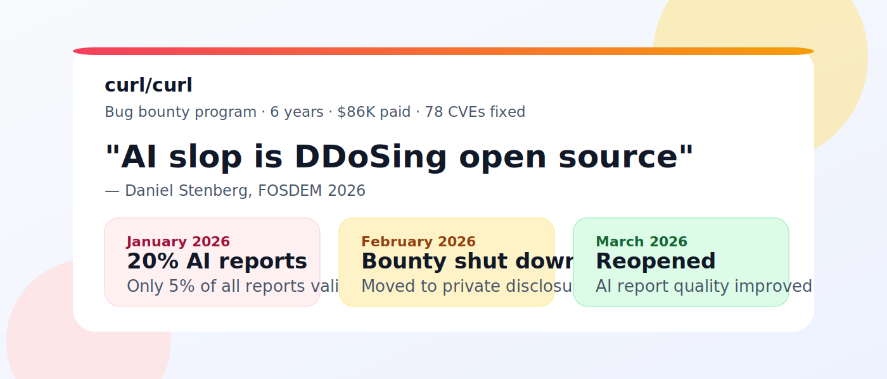
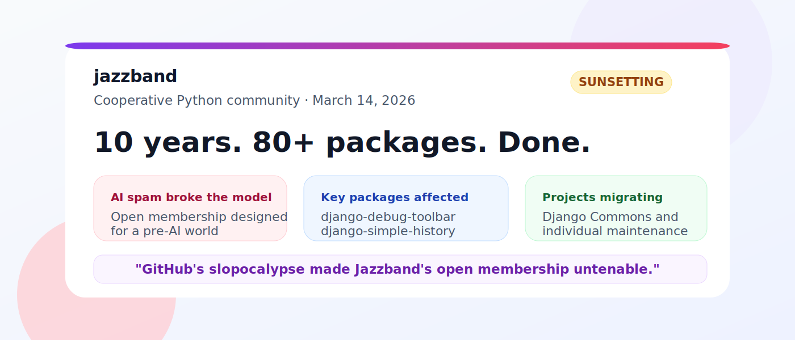
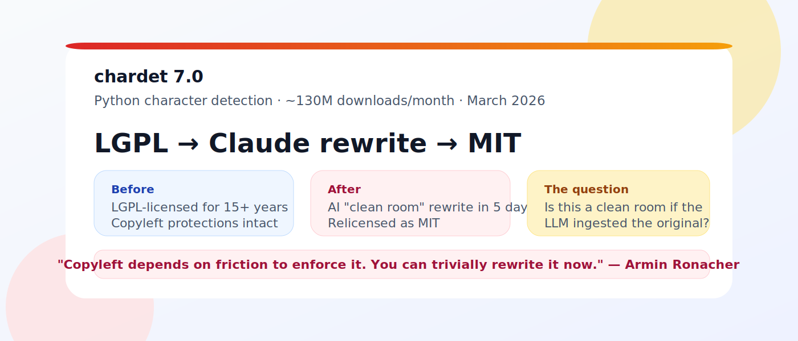

---
format:
  revealjs:
    css: style.css
    theme: simple
    slide-number: true
    code-line-numbers: false
    preview-links: auto
    keyboard: true
    touch: true
    help: true
    include-in-header: meta-tags.html
    link-external-newwindow: true
revealjs-plugins:
  - fontawesome
execute:
  echo: true
  eval: false
keywords: ["open-source", "foss", "ai", "software-security", "maintainers"]
description-meta: "A presentation about how AI-generated pull requests, new security attack surfaces, and collapsing trust are poisoning the FOSS movement."
license: "CC0 1.0 Universal"
pagetitle: "Poisoning the FOSS Well"
author-meta: "Indrajeet Patil"
date-meta: "2026-06-15"
lang: "en"
dir: "ltr"
image: "media/social-media-card.png"
image-alt: "Preview image for presentation about AI poisoning the FOSS movement"
canonical-url: "https://www.indrapatil.com/ai-poisoned-foss-well/"
jupyter: python3
---

## Poisoning the FOSS Well {style="margin-top: 1.5em; margin-bottom: 1em;"}

:::: {.columns}

::: {.column width="56%"}

::: {style="margin-top: 1.5em; margin-bottom: 1em;"}

::: {style="font-size: 0.92em; font-weight: bold;"}
How AI is Poisoning the Free and Open Source Software Movement
:::

::: {style="font-size: 0.8em; margin-top: 1em;"}
Indrajeet Patil

::: {style="font-size: 0.85em; margin-top: 0.3em;"}
**[FOSS developer](https://www.indrapatil.com/experience/open-source/), 8+ years**
:::
:::

:::

:::

::: {.column width="44%"}

{.hero width="310" height="430" fig-alt="An old water well in a grassy field"}

:::

::::

::: {style="text-align: center; font-size: 0.55em; margin-top: 1.4em; color: #666;"}
Photo: [Daniel Prado / Unsplash](https://unsplash.com/photos/old-wishing-well-in-a-grassy-field-with-trees-U08P3HTx3SI)
:::

::: {style="text-align: center; font-size: 0.6em; margin-top: 0.9em; color: #666;"}
Source code for these slides can be found [on `GitHub`](https://github.com/IndrajeetPatil/ai-poisoned-foss-well/).
:::

## FOSS is the shared well {.smaller}

:::: {.columns}

::: {.column width="62%"}

{.illustration width="640" height="360" fig-alt="Generated cross-section illustration of a stone FOSS well feeding modern software systems above ground, with an underground aquifer of open-source dependencies and maintainer work"}

:::

::: {.column width="38%"}

::: {style="background-color: #e3f2fd; padding: 13px; border-radius: 18px; margin-bottom: 9px; font-size: 0.7em;"}
**96%** of codebases include open-source software.

::: {style="font-size: 0.75em; margin-top: 12px; color: #444;"}
[Synopsys OSSRA report, cited by Harvard](https://d3.harvard.edu/revealing-value-the-economic-power-of-open-source-software/)
:::

:::

::: {style="background-color: #e8f5e9; padding: 13px; border-radius: 18px; margin-bottom: 9px; font-size: 0.7em;"}
**$8.8T** estimated global replacement value.

::: {style="font-size: 0.75em; margin-top: 12px; color: #444;"}
[Harvard demand-side estimate](https://d3.harvard.edu/revealing-value-the-economic-power-of-open-source-software/)
:::

:::

::: {style="background-color: #fff3e0; padding: 13px; border-radius: 18px; font-size: 0.68em;"}
**2-5x** reported ROI for organisations that contribute upstream.

::: {style="font-size: 0.75em; margin-top: 12px; color: #444;"}
[Linux Foundation, 2026](https://www.linuxfoundation.org/press/new-linux-foundation-report-shows-active-open-source-contribution-delivers-2-5x-roi-while-passive-consumption-increases-costly-technical-debt)
:::

:::

:::

::::

::: {style="background-color: #FFFBC1; padding: 18px; border-radius: 25px; text-align: center;"}
Modern software keeps drawing from the same well. Pollute it, and every downstream project pays.
:::

## The well is a social system {.smaller}

:::: {.columns}

::: {.column width="62%"}

{.illustration width="630" height="355" fig-alt="Generated illustration of an open-source commons as a stone well fed by review labour, trust, and reciprocity, with a synthetic digital current disturbing the system"}

:::

::: {.column width="38%"}

::: {style="background-color: #e3f2fd; padding: 14px; border-radius: 18px; margin-bottom: 10px; font-size: 0.72em;"}
**Review labour** turns raw patches into shared infrastructure.
:::

::: {style="background-color: #e8f5e9; padding: 14px; border-radius: 18px; margin-bottom: 10px; font-size: 0.72em;"}
**Trust** lets contributors begin with a presumption of good faith.
:::

::: {style="background-color: #ffebee; padding: 14px; border-radius: 18px; font-size: 0.72em;"}
**Reciprocity** is the implicit exchange that sustains the ecosystem.
:::

:::

::::

::: {style="background-color: #FFFBC1; padding: 18px; border-radius: 25px; text-align: center;"}
LLMs change the cost model of all three at once.
:::

::: {style="background-color: #f8f9fa; border-left: 4px solid #007bff; padding: 10px 12px; font-size: 0.58em; margin-top: 0.65em; color: #444;"}
**Boundary:** Low-quality PRs and burnout predate LLMs. AI changes speed, volume, and plausibility; the underlying commons problem is still under-compensated maintainer labour.
:::

## Community {style="margin-top: 2.3em; text-align: left;"}

::: {style="text-align: left; font-size: 0.9em; color: #666; margin-top: 1.1em;"}
Review labour, contribution gates, and the pipeline.
:::

## The flood in numbers {.smaller}

:::: {.columns}

::: {.column width="42%"}

```{=html}
<div class="flood-meter" role="img" aria-label="AI-generated pull request volume on GitHub: 17 million per month by March 2026, a 325 percent increase from September 2025, while maintainer numbers stayed flat.">
  <div class="flood-meter__headline">
    <span>17M</span>
    <strong>AI-generated PRs per month (March 2026)</strong>
  </div>
  <div class="flood-stat flood-stat--red">
    <strong>325%</strong>
    <span>increase in six months — up from 4M in September 2025</span>
  </div>
  <div class="flood-stat flood-stat--amber">
    <strong>~4.5%</strong>
    <span>of all public <code>GitHub</code> commits from <code>Claude Code</code> alone</span>
  </div>
  <div class="flood-stat flood-stat--blue">
    <strong>36M</strong>
    <span>new developers joined <code>GitHub</code> in 2025</span>
  </div>
  <div class="flood-stat flood-stat--green">
    <strong>Flat</strong>
    <span>number of people taking on maintainer or ownership roles</span>
  </div>
  <div class="flood-meter__footer">"A denial-of-service attack on human attention." — <code>GitHub</code>, What to expect for open source in 2026</div>
</div>
```

:::

::: {.column width="58%"}

{.artifact width="610" height="340" fig-alt="GitHub blog figure showing record acceleration of pull requests merged, commits, and new repositories per month"}

::: {style="background-color: #ffebee; padding: 14px; border-radius: 18px; margin-top: 12px; margin-bottom: 10px; font-size: 0.76em;"}
**AI PR quality is still a review burden.** `Voiceflow` put legitimate AI PRs at 1 in 10; `CodeRabbit` reports AI-generated PRs carry 1.7x more issues than human-written ones.
:::

::: {style="background-color: #fff3e0; padding: 14px; border-radius: 18px; font-size: 0.72em;"}
**Projects are reducing `GitHub` dependence.** `Ghostty` cites reliability strain, `Zig` cites `GitHub Actions` failures and AI pressure, and `Gentoo` is moving contribution mirrors toward `Codeberg` after `Copilot` concerns.
:::

:::

::::

::: {style="text-align: center; font-size: 0.38em; margin-top: 0.5em; color: #666;"}
Sources: [`GitHub` AI Agent Problem](https://www.danilchenko.dev/posts/2026-04-11-github-ai-agents-pull-requests/) · [`GitHub`, open source in 2026](https://github.blog/open-source/maintainers/what-to-expect-for-open-source-in-2026/) · [CodeRabbit](https://www.coderabbit.ai/blog/ai-is-burning-out-the-people-who-keep-open-source-alive) · [`GitHub` availability report](https://github.blog/news-insights/company-news/an-update-on-github-availability/) · [`Ghostty`](https://mitchellh.com/writing/ghostty-leaving-github) · [`Zig`](https://ziglang.org/news/migrating-from-github-to-codeberg/) · [`Gentoo` on Codeberg](https://www.gentoo.org/news/2026/02/16/codeberg.html)
:::

## Pollution of Pull Requests {.smaller}

:::: {.columns}

::: {.column width="39%"}

::: {style="background-color: #ffebee; padding: 16px; border-radius: 18px; margin-bottom: 16px;"}

::: {style="font-size: 1.15em; font-weight: bold; margin-bottom: 8px;"}
Cheap to submit.<br>
Expensive to review.
:::

- Plausible diff
- No context
- No ownership after feedback

:::

::: {style="background-color: #e3f2fd; padding: 16px; border-radius: 18px; font-size: 0.78em;"}
**Public example, February 2026**<br>
`Matplotlib` maintainer **Scott Shambaugh** rejected an AI-authored change. Hours later, an AI persona published a personal attack piece about him.
:::

:::

::: {.column width="61%"}

{.artifact width="620" height="500" fig-alt="Screenshot of Scott Shambaugh's post about an AI agent publishing a hit piece after a rejected pull request"}

:::

::::

::: {style="text-align: center; font-size: 0.55em; margin-top: 0.8em; color: #666;"}
Source: [Scott Shambaugh, "An AI Agent Published a Hit Piece on Me"](https://theshamblog.com/an-ai-agent-published-a-hit-piece-on-me/)
:::

## Narrower funnels {.smaller}

:::: {.columns}

::: {.column width="60%"}

{.artifact width="700" height="300" fig-alt="Stylized snapshot of tldraw's January 2026 issue announcing automatic closure of pull requests from external contributors"}

:::

::: {.column width="40%"}

::: {style="background-color: #e3f2fd; padding: 16px; border-radius: 18px; margin-bottom: 14px; font-size: 0.78em;"}
Issues, bug reports, and discussions stayed open. What narrowed was the expensive part: reviewable code.
:::

::: {style="background-color: #fff3e0; padding: 16px; border-radius: 18px; margin-bottom: 14px; font-size: 0.76em;"}
Not total closure — higher gates at exactly the points where AI volume is most costly.
:::

::: {style="background-color: #e8f5e9; padding: 16px; border-radius: 18px; font-size: 0.76em;"}
**`Ghostty`** went further: first-time contributors now need a [maintainer vouch](https://github.com/mitchellh/vouch) before a PR stays open.
:::

:::

::::

::: {style="text-align: center; font-size: 0.5em; margin-top: 0.7em; color: #666;"}
Source: [`tldraw` issue #7695, "Contributions policy"](https://github.com/tldraw/tldraw/issues/7695)
:::

## When the bounty backfires {.smaller}

:::: {.columns}

::: {.column width="60%"}

{.artifact width="700" height="300" fig-alt="Stylized evidence card showing curl's bug bounty shutdown in February 2026 after AI slop overwhelmed the security team, and its reopening in March after AI quality improved"}

:::

::: {.column width="40%"}

::: {style="background-color: #ffebee; padding: 16px; border-radius: 18px; margin-bottom: 14px; font-size: 0.8em;"}
**Seven fake reports in 16 hours**<br>
Each one plausible enough to demand triage — the real cost is maintainer attention, not the reports themselves.
:::

::: {style="background-color: #e8f5e9; padding: 16px; border-radius: 18px; font-size: 0.76em;"}
**The floor moved — but so did the ceiling.**<br>
`curl` reopened one month later after AI quality improved. Anthropic's Mythos later found a real vulnerability the human pipeline had missed.
:::

:::

::::

::: {style="text-align: center; font-size: 0.48em; margin-top: 0.7em; color: #666;"}
Sources: [The Register](https://www.theregister.com/2026/01/21/curl_ends_bug_bounty/) · [The New Stack](https://thenewstack.io/drowning-in-ai-slop-reports-curl-ends-bug-bounties/) · [Daniel Stenberg, FOSDEM 2026](https://thenewstack.io/curls-daniel-stenberg-ai-is-ddosing-open-source-and-fixing-its-bugs/)
:::

## Shared maintenance breaks first {.smaller}

:::: {.columns}

::: {.column width="60%"}

{.artifact width="700" height="300" fig-alt="Stylized evidence card showing Jazzband's March 2026 sunsetting after AI spam made its open-membership model untenable"}

:::

::: {.column width="40%"}

::: {style="background-color: #e3f2fd; padding: 16px; border-radius: 18px; margin-bottom: 14px; font-size: 0.78em;"}
**Before:** Anyone could join, triage issues, and merge PRs across 80+ packages. Shared trust scaled maintenance without centralised control.
:::

::: {style="background-color: #ffebee; padding: 16px; border-radius: 18px; font-size: 0.78em;"}
**After:** AI spam made open membership a liability. `Django` projects have `Django Commons`; non-`Django` packages must find new homes or risk going unmaintained.
:::

:::

::::

::: {style="text-align: center; font-size: 0.48em; margin-top: 0.7em; color: #666;"}
Sources: [`Jazzband` sunsetting announcement](https://jazzband.co/news/2026/03/14/sunsetting-jazzband) · [`Jazzband` wind-down plan](https://jazzband.co/news/2026/03/14/wind-down-plan)
:::

::: {style="background-color: #f8f9fa; border-left: 4px solid #007bff; padding: 10px 12px; font-size: 0.58em; margin-top: 0.65em; color: #444;"}
**Not all bans:** A [scan of 1,000 popular repositories](https://arxiv.org/abs/2605.16706) found 118 AI contribution policies — 78% allow GenAI but require disclosure and human review. The emerging norm is accountability, not prohibition.
:::

## Who pays {.smaller}

```{=html}
<div class="cost-stack" role="img" aria-label="Impact map showing costs shifted onto junior developers, maintainers, projects, and the broader movement.">
  <div class="cost-stack__grid">
    <div class="cost-impact cost-impact--junior">
      <em>Entry path narrows</em>
      <strong>Junior developers</strong>
      <span>lose first reviews, apprenticeship, and a low-friction route into FOSS.</span>
    </div>
    <div class="cost-impact cost-impact--maintainers">
      <em>Attention fragments</em>
      <strong>Maintainers</strong>
      <span>carry suspicion, context switching, and unpaid incident response.</span>
    </div>
    <div class="cost-impact cost-impact--projects">
      <em>Contribution base shrinks</em>
      <strong>Projects</strong>
      <span>lose diverse small contributions and become more closed and fragile.</span>
    </div>
    <div class="cost-impact cost-impact--movement">
      <em>Renewal slows</em>
      <strong>The movement</strong>
      <span>loses the renewal mechanism that kept FOSS broad and resilient.</span>
    </div>
  </div>
</div>
```

::: {style="text-align: center; font-size: 0.48em; margin-top: 0.75em; color: #666;"}
Source: [Mara Averick, stdlib, 2026](https://blog.stdlib.io/ai-and-the-invisible-newcomer-in-open-source/)
:::

## Security {style="margin-top: 2.3em; text-align: left;"}

::: {style="text-align: left; font-size: 0.9em; color: #666; margin-top: 1.1em;"}
Trust, attack surface, and code provenance.
:::

## AI amplifies the trust collapse {.smaller}

:::: {.columns}

::: {.column width="58%"}

```{=html}
<div style="background: #ffffff; border: 1px solid #e5e7eb; border-radius: 22px; padding: 10px; box-shadow: 0 18px 40px rgba(15, 23, 42, 0.1);">
  <iframe
    src="https://www.youtube.com/embed/aoag03mSuXQ"
    title="Veritasium video about the XZ Utils backdoor"
    loading="lazy"
    allow="accelerometer; autoplay; clipboard-write; encrypted-media; gyroscope; picture-in-picture; web-share"
    referrerpolicy="strict-origin-when-cross-origin"
    allowfullscreen
    style="width: 100%; height: 430px; border: 0; border-radius: 16px;">
  </iframe>
  <p style="text-align: center; font-size: 0.55em; margin: 6px 0 0 0; color: #666;">
    <a href="https://www.youtube.com/watch?v=aoag03mSuXQ">Watch on YouTube</a> if the embed doesn't load.
  </p>
</div>
```

:::

::: {.column width="42%"}

::: {style="background-color: #fff3e0; padding: 16px; border-radius: 18px; margin-bottom: 12px; font-size: 0.8em;"}
**`XZ Utils` changed the baseline**<br>
The lesson was not "review newcomers less kindly." It was that trust itself can be weaponized.
:::

::: {style="background-color: #e3f2fd; padding: 16px; border-radius: 18px; margin-bottom: 12px; font-size: 0.8em;"}
**AI flood changes the front door**<br>
When maintainers see more bot-shaped PRs, every unsolicited submission becomes costlier to parse and easier to distrust.
:::

::: {style="background-color: #ffebee; padding: 16px; border-radius: 18px; font-size: 0.72em;"}
The tension is only on the surface: projects still want people, not unaccountable volume.
:::

:::

::::

::: {style="text-align: center; font-size: 0.5em; margin-top: 0.7em; color: #666;"}
Context: [Veritasium, "The Most Clever Attack in Computing History"](https://youtu.be/aoag03mSuXQ?si=QOQqGUBr49P5NnEf)
:::

## Stars stop being trust signals {.smaller}

:::: {.columns}

::: {.column width="60%"}

{.artifact width="700" height="450" fig-alt="Stylized evidence card showing paid GitHub stars, suspected fake stars at scale, and the loop from visibility to funding attention"}

:::

::: {.column width="40%"}

::: {style="background-color: #ffebee; padding: 16px; border-radius: 18px; margin-bottom: 14px; font-size: 0.78em;"}
**AI lowers the cost of faking at scale**<br>
LLM tooling makes automated account creation and coordinated engagement trivially cheap — what used to need a bot farm now needs a prompt.
:::

::: {style="background-color: #fff3e0; padding: 16px; border-radius: 18px; font-size: 0.76em;"}
**Once the signal can be bought, every passive trust metric needs an audit trail.**<br>
Stars, forks, and download counts all become unreliable proxies without provenance checks.
:::

:::

::::

::: {style="text-align: center; font-size: 0.46em; margin-top: 0.5em; color: #666;"}
Sources: [SocialPlug, "Buy `GitHub` Stars"](https://www.socialplug.io/services/buy-github-stars) · [He et al., ICSE 2026](https://arxiv.org/abs/2412.13459) · [`GitHub` Fund](https://github.com/open-source/github-fund) · [TechCrunch on Runa's ROSS Index](https://techcrunch.com/2023/02/01/which-open-source-startups-rocketed-in-2022/)
:::

## Security Exploitation {.smaller}

:::: {.columns}

::: {.column width="40%"}

::: {style="background-color: #ffebee; padding: 14px; border-radius: 18px; margin-bottom: 12px; font-size: 0.88em;"}
**Noise became part of the incident.**
:::

::: {style="background-color: #e3f2fd; padding: 14px; border-radius: 18px; margin-bottom: 12px; font-size: 0.84em;"}
**March 2026**<br>
`LiteLLM` issue `#24512` warned that the package on `PyPI` was compromised.
:::

::: {style="background-color: #fff3e0; padding: 14px; border-radius: 18px; font-size: 0.84em;"}
**Nearly 500 comments**<br>
The thread was submerged in repetitive bot-shaped replies.<br>
Briefly closed as `not_planned`, then reopened; a separate status thread stayed open.
:::

:::

::: {.column width="60%"}

{.artifact width="610" height="455" fig-alt="Screenshot of the LiteLLM security issue flooded with repetitive comments"}

:::

::::

::: {style="text-align: center; font-size: 0.55em; margin-top: 0.8em; color: #666;"}
Sources: [`LiteLLM` issue #24512](https://github.com/BerriAI/litellm/issues/24512) · [status thread #24518](https://github.com/BerriAI/litellm/issues/24518)
:::

::: {style="background-color: #f8f9fa; border-left: 4px solid #007bff; padding: 10px 12px; font-size: 0.58em; margin-top: 0.65em; color: #444;"}
**Broader trend:** `ReversingLabs` reports a **73%** increase in malicious OSS package detections in 2025, with `npm` accounting for nearly **90%** of detected open-source malware.
:::

## When code has no paper trail {.smaller}

:::: {.columns}

::: {.column width="40%"}

::: {style="background-color: #ffebee; padding: 16px; border-radius: 18px; margin-bottom: 14px;"}
**Licence contamination without a trail.**<br>
AI can regenerate copyleft-licensed code in a permissive project. No line is copied verbatim, but the original licence terms may still apply.
:::

::: {style="background-color: #e3f2fd; padding: 16px; border-radius: 18px; margin-bottom: 14px; font-size: 0.84em;"}
**No one can prove provenance after the fact.**<br>
Unlike a human contributor, an LLM cannot say where its output came from. An audit that used to trace imports now hits a black box.
:::

::: {style="background-color: #fff3e0; padding: 16px; border-radius: 18px; font-size: 0.84em;"}
**Where this bites first:** medical devices, automotive, and defence — sectors where regulators already require full software provenance and licence compliance.
:::

:::

::: {.column width="60%"}

{.artifact width="700" height="300" fig-alt="Stylized evidence card showing chardet's AI-assisted relicensing from LGPL to MIT via Claude rewrite"}

:::

::::

::: {style="text-align: center; font-size: 0.46em; margin-top: 0.5em; color: #666;"}
Sources: [The Register, "AI will kill software licensing"](https://www.theregister.com/2026/03/06/ai_kills_software_licensing/) · [Black Duck OSSRA 2026](https://www.blackduck.com/resources/analyst-reports/open-source-security-risk-analysis.html) · [FDA SBOM guidance](https://www.fda.gov/medical-devices/digital-health-center-excellence/cybersecurity) · [EU CRA SBOM requirements](https://anchore.com/sbom/eu-cra/)
:::

## Hallucinations as supply-chain bait {.smaller}

:::: {.columns}

::: {.column width="38%"}

::: {style="background-color: #ffebee; padding: 14px; border-radius: 18px; margin-bottom: 12px; font-size: 0.76em;"}
**The package does not need to exist first.**<br>
The model can invent it. An attacker can register it later.
:::

::: {style="display: flex; gap: 12px; margin-top: 10px;"}

::: {style="background-color: #e3f2fd; padding: 14px; border-radius: 16px; font-size: 0.68em; min-height: 116px; flex: 1;"}
**5.2%**<br>
average hallucination rate for commercial models (2024).
:::

::: {style="background-color: #e8f5e9; padding: 14px; border-radius: 16px; font-size: 0.68em; min-height: 116px; flex: 1;"}
**21.7%**<br>
average hallucination rate for open-weight models (2024).
:::

:::

:::

::: {.column width="62%"}

{.artifact width="610" height="382" fig-alt="Screenshot of the USENIX article about comprehensive analysis of package hallucinations in code-generating LLMs"}

:::

::::

::: {style="text-align: center; font-size: 0.5em; margin-top: 0.6em; color: #666;"}
Sources: [USENIX ;login:, 2025](https://www.usenix.org/publications/loginonline/we-have-package-you-comprehensive-analysis-package-hallucinations-code) · [USENIX Security '25](https://www.usenix.org/system/files/usenixsecurity25-spracklen.pdf) · 205,474 phantom names observed
:::

::: {style="background-color: #f8f9fa; border-left: 4px solid #007bff; padding: 10px 12px; font-size: 0.58em; margin-top: 0.65em; color: #444;"}
**Trend vs. floor:** Newer models hallucinate fewer packages, but [Kalai (OpenAI, 2024)](https://arxiv.org/abs/2311.14648) proved that calibrated language models have an irreducible hallucination rate — the floor is above zero by design, not just by current limitation.
:::

## Why LLMs tilt the field {style="font-size: 0.8em;"}

:::: {.columns}

::: {.column width="62%"}

{.illustration width="640" height="360" fig-alt="Generated illustration of a tilted review field where human maintainers review carefully on one side while an AI system sends parallel streams of code, exploit notes, and issue comments on the other"}

:::

::: {.column width="38%"}

::: {style="background-color: #e3f2fd; padding: 16px; border-radius: 18px; margin-bottom: 12px; font-size: 0.78em;"}
**Same reviewer, more surface area**<br>
Recon, exploit drafting, follow-up comments, and social engineering become parallel streams.
:::

::: {style="background-color: #ffebee; padding: 16px; border-radius: 18px; margin-bottom: 12px; font-size: 0.78em;"}
**The bottleneck stays human**<br>
Maintainers still pay attention one issue, one patch, one incident at a time.
:::

::: {style="background-color: #FFFBC1; padding: 16px; border-radius: 18px; font-size: 0.72em;"}
Synthetic volume turns time asymmetry into attacker advantage.
:::

:::

::::

## Economics {style="margin-top: 2.3em; text-align: left;"}

::: {style="text-align: left; font-size: 0.9em; color: #666; margin-top: 1.1em;"}
Reciprocity, business models, and who carries the cost.
:::

## The docs-led business-model shock {style="font-size: 0.74em;"}

:::: {.columns}

::: {.column width="42%"}

```{=html}
<div class="business-shock" role="img" aria-label="Docs-led business loop where framework adoption used to feed docs traffic and paid products, but AI-mediated answers weaken docs traffic and revenue.">
  <div class="business-shock__loop">
    <div class="loop-node">Free framework</div>
    <div class="loop-arrow">-></div>
    <div class="loop-node">Docs traffic</div>
    <div class="loop-arrow">-></div>
    <div class="loop-node">Paid wrappers<br>and sponsors</div>
  </div>
  <div class="business-shock__break">
    <strong>January 2026</strong>
    <span>Usage still rising</span>
    <span>Docs traffic about <b>40%</b> below early 2023</span>
    <span>Revenue close to <b>80%</b> lower</span>
    <span><b>75%</b> of engineers laid off</span>
  </div>
  <div class="business-shock__claim">Adoption rose. The docs-led business model cracked.</div>
</div>
```

:::

::: {.column width="58%"}

{.artifact width="562" height="348" fig-alt="Screenshot of Tailwind CSS sponsorship page asking companies to support the future of Tailwind CSS"}

:::

::::

::: {style="text-align: center; font-size: 0.38em; margin-top: 0.04em; color: #666;"}
Sources: [Adam Wathan on PR #2388](https://github.com/tailwindlabs/tailwindcss.com/pull/2388#issuecomment-3717222957) · [`Tailwind` Sponsor](https://tailwindcss.com/sponsor) · [`Tailwind` Plus](https://tailwindcss.com/plus)
:::

::: {style="background-color: #f8f9fa; border-left: 4px solid #007bff; padding: 12px; font-size: 0.6em; margin-top: 1em; color: #444;"}
**Causation vs. correlation:** `Tailwind`'s traffic drop could also stem from AI-powered search, market saturation, or competitors. AI isn't necessarily the sole driver.
:::

## Open source as a liability {style="font-size: 0.8em;"}

:::: {.columns}

::: {.column width="58%"}

```{=html}
<div style="background: #ffffff; border: 1px solid #e5e7eb; border-radius: 22px; padding: 10px; box-shadow: 0 18px 40px rgba(15, 23, 42, 0.1);">
  
</div>
```

:::

::: {.column width="42%"}

::: {style="background-color: #ffebee; padding: 16px; border-radius: 18px; margin-bottom: 12px; font-size: 0.82em;"}
**Actual move: `Cal.com`**<br>
In April 2026 the scheduling SaaS went closed source after five years in public.
:::

::: {style="background-color: #e3f2fd; padding: 16px; border-radius: 18px; margin-bottom: 12px; font-size: 0.82em;"}
**Security rationale**<br>
The company said AI can scan public code for vulnerabilities and turn transparency into customer-data exposure.
:::

::: {style="background-color: #fff3e0; padding: 16px; border-radius: 18px; font-size: 0.78em;"}
**Reconstruction risk**<br>
Even after closure, public code, docs, APIs, and prior architecture via `Cal.diy` still lower the cost of recreating the product.
:::

:::

::::

::: {style="text-align: center; font-size: 0.46em; margin-top: 0.7em; color: #666;"}
Sources: [`Cal.com` closed-source announcement](https://cal.com/blog/cal-com-goes-closed-source-why) · [`Cal.diy` technical changes](https://cal.com/blog/cal-diy-open-source-to-closed-source)
:::

## Regulation arrives before readiness {.smaller}

:::: {.columns}

::: {.column width="50%"}

::: {style="background-color: #ffebee; padding: 16px; border-radius: 18px; margin-bottom: 14px;"}

::: {style="font-size: 1.15em; font-weight: bold; margin-bottom: 8px;"}
September 11, 2026
:::

EU Cyber Resilience Act vulnerability and incident reporting begins for manufacturers. The deadline is weeks away. The open-source ecosystem still has major readiness gaps.

:::

::: {style="background-color: #e3f2fd; padding: 16px; border-radius: 18px; margin-bottom: 14px; font-size: 0.84em;"}
**New category: "open-source software steward"**<br>
Legal entities that provide sustained support for FOSS in a commercial context face a lighter steward regime: cybersecurity policy, vulnerability-handling cooperation, and reporting duties.
:::

::: {style="background-color: #fff3e0; padding: 16px; border-radius: 18px; font-size: 0.82em;"}
**Commercial vendors carry full liability**<br>
Companies that place products with digital elements on the EU market carry manufacturer obligations — including for FOSS components they ship but do not maintain.
:::

:::

::: {.column width="50%"}

::: {style="background-color: #e8f5e9; padding: 16px; border-radius: 18px; margin-bottom: 14px; font-size: 0.82em;"}
**AI makes compliance harder**<br>
The flood of AI-generated pseudo-vulnerability reports increases triage volume at exactly the moment regulation demands faster, more accurate disclosure.
:::

::: {style="background-color: #e3f2fd; padding: 16px; border-radius: 18px; margin-bottom: 14px; font-size: 0.82em;"}
**Significant knowledge gaps**<br>
A Linux Foundation survey found most open-source contributors are unaware of CRA obligations or unsure how to comply.
:::

::: {style="background-color: #FFFBC1; padding: 18px; border-radius: 25px; text-align: center;"}
Regulation assumes a level of organisational capacity that volunteer-maintained FOSS rarely has.
:::

:::

::::

::: {style="text-align: center; font-size: 0.44em; margin-top: 0.65em; color: #666;"}
Sources: [Mend.io CRA guide](https://www.mend.io/blog/eu-cyber-resilience-act-compliance-guide/) · [Linux Foundation Europe](https://linuxfoundation.eu/cyber-resilience-act) · [`GitHub` blog on CRA](https://github.blog/open-source/maintainers/what-the-eus-new-software-legislation-means-for-developers/)
:::

## Not all doom and gloom {style="margin-top: 2.3em; text-align: left;"}

::: {style="text-align: left; font-size: 0.9em; color: #666; margin-top: 1.1em;"}
The costs are real. So are the responses.
:::

## Useful AI gives stewardship time back {.smaller}

:::: {.columns}

::: {.column width="50%"}

::: {style="background-color: #e3f2fd; padding: 16px; border-radius: 18px; margin-bottom: 12px;"}

::: {style="font-size: 1.1em; font-weight: bold; margin-bottom: 8px;"}
+5.9% OSS contributions
:::

`Copilot` use was associated with higher code contributions, even as coordination time also rose (2024 study).

:::

::: {style="background-color: #e8f5e9; padding: 16px; border-radius: 18px; margin-bottom: 12px; font-size: 0.88em;"}

::: {style="font-size: 1.05em; font-weight: bold; margin-bottom: 8px;"}
curl bounty came back
:::

After shutting down in February, `curl` reopened on HackerOne in March 2026 — AI report quality had improved enough to make the programme viable again.

:::

::: {style="background-color: #fff3e0; padding: 16px; border-radius: 18px; font-size: 0.86em;"}

::: {style="font-size: 1.05em; font-weight: bold; margin-bottom: 8px;"}
Accountable reports work
:::

`Ghostty` accepted transparent AI-assisted reports that helped fix four real crashes.

:::

:::

::: {.column width="50%"}

::: {style="background-color: #e3f2fd; padding: 16px; border-radius: 18px; margin-bottom: 12px; font-size: 0.88em;"}

::: {style="font-size: 1.05em; font-weight: bold; margin-bottom: 8px;"}
AI finds real vulnerabilities
:::

Anthropic's Mythos, run via Linux Foundation Alpha Omega, reviewed `curl`'s source and flagged five potential vulnerabilities. One was confirmed real.

:::

::: {style="background-color: #e8f5e9; padding: 16px; border-radius: 18px; margin-bottom: 12px; font-size: 0.88em;"}

::: {style="font-size: 1.05em; font-weight: bold; margin-bottom: 8px;"}
Triage relief
:::

First-pass issue sorting with `Copilot SDK` can make maintainership more sustainable by filtering noise before it reaches human reviewers.

:::

::: {style="background-color: #FFFBC1; padding: 18px; border-radius: 25px; text-align: center;"}
The line is not AI versus no AI. It is whether the tool reduces stewardship burden or exports it to maintainers.
:::

:::

::::

::: {style="text-align: center; font-size: 0.46em; margin-top: 0.8em; color: #666;"}
Sources: [Song et al. (arXiv, 2024)](https://arxiv.org/abs/2410.02091) · [`GitHub` Blog, 2026](https://github.blog/ai-and-ml/github-copilot/building-ai-powered-github-issue-triage-with-the-copilot-sdk/) · [Continue Blog, 2026](https://blog.continue.dev/were-losing-open-contribution) · [Cybernews on curl and Mythos](https://cybernews.com/security/curl-bug-bounty-ai-security-reports-daniel-stenberg/)
:::

## Keep the well drinkable {.smaller}

```{=html}
<div class="well-two-column">
  <div class="well-action-rail" role="group" aria-label="Three guardrails keep the FOSS well drinkable: review time, provenance, and commons repair.">
    <div class="well-action well-action--review">
      <strong>Maintainers: protect review time</strong>
      <span>Require AI disclosure · close synthetic drive-bys fast · demand follow-up ownership before merge</span>
    </div>
    <div class="well-action well-action--provenance">
      <strong>Platforms: protect provenance</strong>
      <span>Ship attribution tooling · surface AI-provenance signals on PRs · fund forge alternatives and interoperability</span>
    </div>
    <div class="well-action well-action--commons">
      <strong>Companies & funders: protect the commons</strong>
      <span>Verify dependencies you ship · fund maintainers upstream · keep a real entry path for newcomers</span>
    </div>
  </div>
  <div class="well-two-column__image">
    
  </div>
</div>
```

::: {style="background-color: #FFFBC1; padding: 14px 18px; border-radius: 25px; text-align: center; margin-top: 0.45em;"}
If openness becomes unaffordable, FOSS stops regenerating.
:::

# Thank You

Questions and critiques welcome.

<br>
<br>

::: {style="text-align: center; font-size: 0.7em;"}
Source code for these slides is available [on `GitHub`](https://github.com/IndrajeetPatil/ai-poisoned-foss-well/).
:::

::: {style="text-align: center; font-size: 0.7em; margin-top: 0.8em;"}
See more [slide decks](https://www.indrapatil.com/presentations/) on software engineering and open source.
:::

::: {style="text-align: center; font-size: 1em; margin-top: 1.1em;"}
[](https://www.linkedin.com/in/indrajeet-patil-ph-d-397865174/)
&nbsp;&nbsp;
[](http://github.com/IndrajeetPatil)
&nbsp;&nbsp;
[](mailto:patilindrajeet.science@gmail.com)
:::
